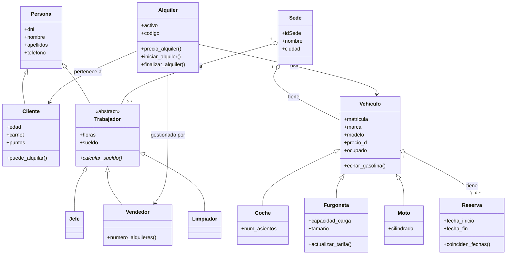
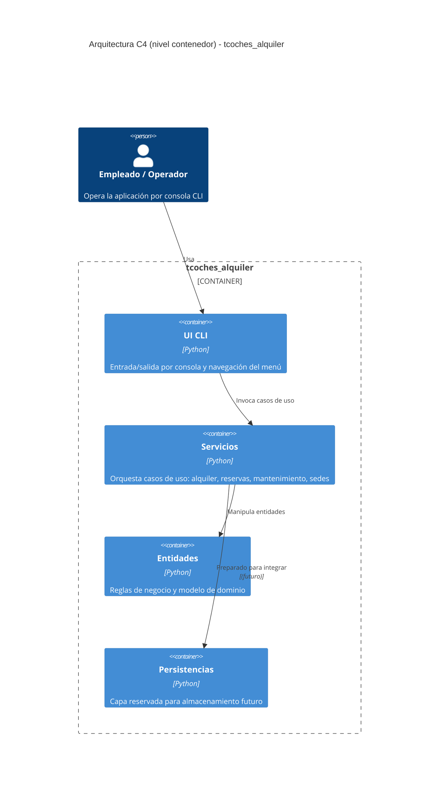

# tcoches_alquiler

Aplicación de consola para gestionar vehículos, clientes, trabajadores, sedes y alquileres, con separación por capas (`Entidades`, `Servicios`, `UI`, `Persistencias`).

**Autores:** Samuel y Lorenzo

## Objetivo del proyecto

Este repositorio implementa un dominio académico de empresa de alquiler de vehículos con foco en:

- Modelado orientado a objetos y encapsulación
- Herencia y polimorfismo (`Vehiculo` como base de `Coche`, `Furgoneta` y `Moto`)
- Jerarquía de trabajadores con método abstracto `calcular_sueldo`
- Reglas de negocio explícitas sin lógica de presentación en dominio/servicios
- Arquitectura por capas con dependencias dirigidas (`UI → Servicios → Entidades`)

## Requisitos

- Python 3.12 o superior
- `pytest` para ejecutar tests (opcional)

## Instalación rápida

```bash
python3 -m venv .venv
source .venv/bin/activate
pip install -U pip pytest
```

## Cómo ejecutar la aplicación

```bash
python main.py
```

`main.py` construye todas las dependencias, carga una pseudobase de datos inicial con sedes, vehículos, clientes y trabajadores de ejemplo, y arranca el `Menu` (`UI/menu.py`).

## Flujo disponible en la CLI

Menú principal (`UI/menu.py`):

1. Gestión de clientes
2. Gestión de trabajadores
3. Gestión de sedes y vehículos
4. Gestión de mantenimiento
5. Gestión de alquileres
6. Salir

### Submenú Clientes
- Alta y baja de cliente
- Búsqueda por DNI
- Añadir / eliminar método de pago (Tarjeta Crédito, Cuenta Bancaria, Cheque, Efectivo)

### Submenú Trabajadores
- Contratar / despedir trabajador (jefe, vendedor, limpiador)
- Buscar por DNI
- Consultar mejor vendedor

### Submenú Sedes y Vehículos
- Alta de sede
- Añadir coche, furgoneta o moto a una sede
- Eliminar / mover vehículo entre sedes
- Asignar / retirar trabajador de sede
- Listar vehículos disponibles u ocupados

### Submenú Mantenimiento
- Registrar avería en un vehículo
- Reparar vehículo y obtener coste
- Calcular coste de reparación sin ejecutarla

### Submenú Alquileres
- Crear reserva para un vehículo
- Crear alquiler (vincula cliente, vehículo y vendedor)
- Buscar alquiler por código

## Reglas de negocio

### Clientes

- El cliente debe ser **mayor de edad** (≥ 18 años) para poder darse de alta en el sistema.
- Para poder realizar un alquiler, el cliente debe tener **al menos un método de pago** registrado (Tarjeta Crédito, Cuenta Bancaria, Cheque o Efectivo).
- Un cliente **no puede tener duplicado** el mismo método de pago.
- Los métodos de pago aceptados son únicamente los cuatro predefinidos; cualquier otro valor es rechazado.

### Reservas

- Antes de crear un alquiler, el vehículo debe tener una **reserva previa** con exactamente las mismas fechas de inicio y fin.
- No se pueden crear dos reservas cuyas fechas se **solapen** en el mismo vehículo.
- Las fechas deben seguir el formato `DD-MM-YYYY`; cualquier otro formato es inválido.
- La fecha de fin debe ser **posterior** a la de inicio.

### Alquileres

- Solo puede gestionar un alquiler un trabajador con rol **Vendedor**; un Jefe o Limpiador no puede crear alquileres.
- El vehículo debe estar **disponible** (no ocupado) en el momento de crear el alquiler.
- Al iniciar el alquiler el cliente recibe **20 puntos** de fidelidad y el vehículo pasa a estado ocupado.
- Al finalizar el alquiler la fecha de devolución debe ser **igual o posterior** a la de recogida.
- No se puede finalizar un alquiler con una fecha anterior a la de recogida del vehículo.

### Descuentos y puntos de fidelidad

- Alquiler de **7 a 13 días**: descuento del **5 %** sobre el precio base.
- Alquiler de **14 días o más**: descuento del **10 %** sobre el precio base.
- Si el cliente tiene **100 puntos o más**, puede canjear **25 puntos** por un descuento adicional del **10 %**.
- Los descuentos por duración y por puntos son **acumulables**.

### Trabajadores

- Los tres roles disponibles son `jefe`, `vendedor` y `limpiador`; cualquier otro cargo es rechazado.
- No se puede contratar a un trabajador con un DNI ya registrado en el sistema.
- Los sueldos se calculan automáticamente al contratar según el rol:
  - **Jefe**: 100 € / hora
  - **Vendedor**: 15 € / hora
  - **Limpiador**: 10 € / hora
- Un trabajador solo puede ser asignado **una vez** a la misma sede.

### Vehículos y sedes

- No se pueden registrar dos vehículos con la **misma matrícula** en todo el sistema.
- Echar gasolina a un vehículo de tipo `electrico` genera automáticamente una **avería** ("Explosión de motor por combustible").
- No se puede superar la **capacidad del depósito** al repostar; si se intenta, el depósito queda al máximo.
- Una avería solo se puede añadir si pertenece al catálogo de averías predefinido y el vehículo **no la tiene ya** registrada.
- No se puede registrar la misma sede dos veces (mismo ID de sede).

### Furgonetas

- El precio diario de una furgoneta se ajusta automáticamente según:
  - Capacidad de carga: 800 kg → ×1.0 | 1000 kg → ×1.1 | 1200 kg → ×1.2
  - Tamaño: Pequeña → +0 € | Mediana → +10 € | Grande → +20 €
- Un tamaño fuera de los valores permitidos es rechazado.

## Arquitectura y estructura

```text
tcoches_alquiler/
├── Entidades/          # Dominio puro: entidades y reglas de negocio
│   ├── vehiculo.py
│   ├── coche.py
│   ├── coche_electrico.py
│   ├── furgoneta.py
│   ├── moto.py
│   ├── persona.py
│   ├── cliente.py
│   ├── trabajador.py
│   ├── jefe.py
│   ├── vendedor.py
│   ├── limpiador.py
│   ├── sede.py
│   ├── alquiler.py
│   └── reserva.py
├── Servicios/          # Casos de uso / orquestación
│   ├── GestionCliente.py
│   ├── GestionTrabajador.py
│   ├── GestionSede.py
│   ├── GestionMantenimiento.py
│   ├── GestionAlquiler.py
│   └── utils_fecha.py
├── UI/                 # CLI delgada
│   └── menu.py
├── Persistencias/      # Reservado para persistencia futura
└── main.py             # Punto de entrada
```

### Responsabilidades por capa

Regla arquitectónica: `UI` solo depende de `Servicios`; `UI` no puede importar `Entidades` directamente (flujo permitido: `UI → Servicios → Entidades`).

- `Entidades/`: invariantes, estado y comportamiento de negocio.
- `Servicios/`: coordinación entre entidades para los casos de uso (sin I/O de consola).
- `UI/`: traducción de entrada/salida del usuario.
- `Persistencias/`: preparada para evolucionar a almacenamiento real.

## Ejemplo rápido de uso en código

```python
from Servicios.GestionSede import GestionSede
from Servicios.GestionTrabajador import GestionTrabajador
from Servicios.GestionCliente import GestionCliente
from Servicios.GestionAlquiler import GestionAlquiler

gestor_trabajador = GestionTrabajador()
gestor_sede = GestionSede(gestor_trabajador)
gestor_cliente = GestionCliente()
gestor_alquiler = GestionAlquiler(gestor_cliente, gestor_sede, gestor_trabajador)

gestor_sede.añadir_sede('S1', 'Sede Alicante', 'Alicante', 'Calle Mayor 1', '965000000')
gestor_sede.añadir_coche('S1', '1234ABC', 'Toyota', 'Corolla', 'Rojo', 50, 'gasolina', 6.5, 40, 5)

gestor_cliente.añadir_cliente('12345678Z', 'Ana', 'García López', 600111222, 25, 'B')
gestor_cliente.añadir_metodo_pago('12345678Z', 'Tarjeta Credito')

gestor_alquiler.crear_reserva('1234ABC', '01-05-2026', '05-05-2026')
```

## Diagrama UML de clases (Mermaid)



## Diagrama de arquitectura C4 (Mermaid)



## Ejecutar tests

```bash
python -m pytest -q
```

## Estado actual y evolución

- Persistencia real aún no implementada (`Persistencias/__init__.py` placeholder).
- `CocheElectrico` definido en `Entidades/coche_electrico.py` pendiente de implementación completa.
- La lógica de descuento en `Alquiler.precio_alquiler()` referencia `self.dias_alquiler` — pendiente de unificar con `diferecia_dias`.

## Notas

Proyecto desarrollado con fines educativos en el contexto de programación orientada a objetos con Python.
